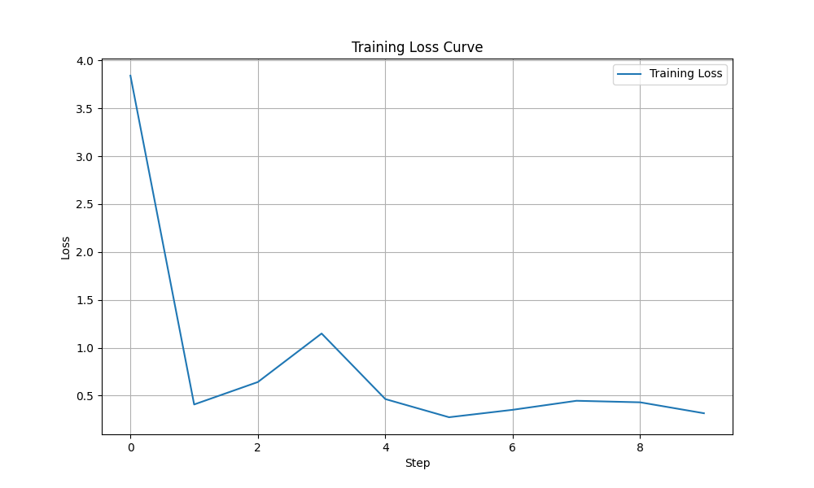
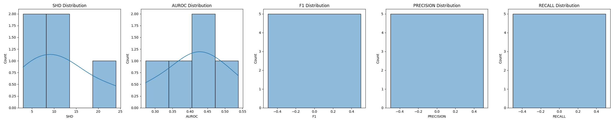
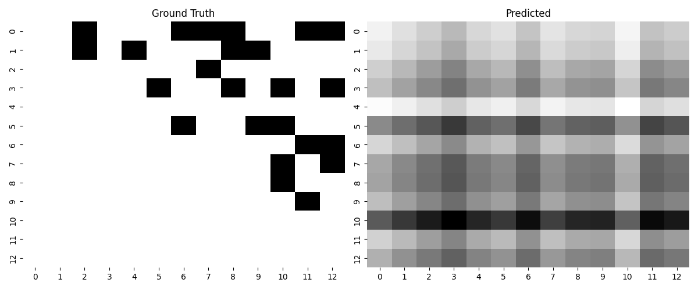
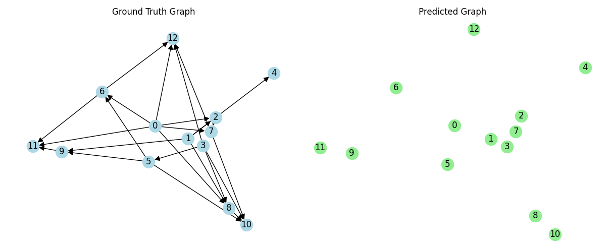
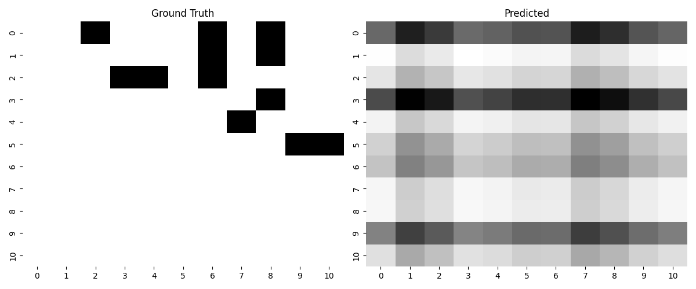
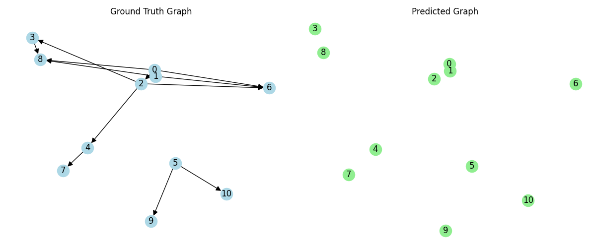
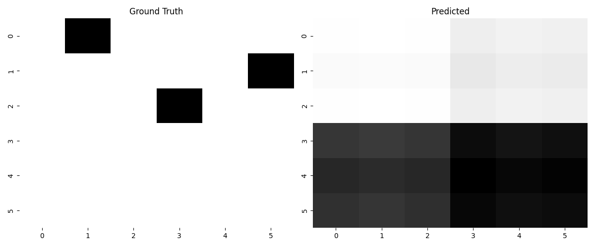
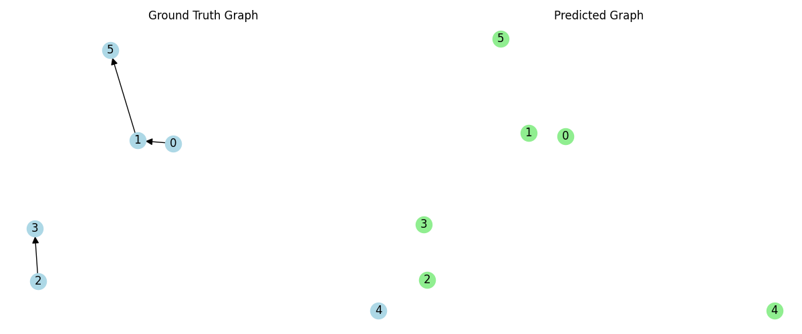

# TabSCM Model Report

## 1. Model Architecture & Configuration
- **Max Columns**: 20
- **Embedding Dimension**: 32
- **Training Steps**: 10
- **Batch Size**: 2
- **Learning Rate**: 0.001

## 2. Training Performance
The model was trained for 10 steps.

## 3. Test Performance (Zero-Shot)
Evaluated on 5 unseen synthetic SCMs.

| Metric | Mean | Std Dev |
| :--- | :--- | :--- |
| **SHD** | 11.6000 | 7.2277 |
| **AUROC** | 0.4141 | 0.0867 |
| **F1** | 0.0000 | 0.0000 |
| **PRECISION** | 0.0000 | 0.0000 |
| **RECALL** | 0.0000 | 0.0000 |

## 4. Visualizations
### Metric Distributions

### Sample Predictions
Below are comparisons of Ground Truth vs Predicted Adjacency Matrices and Graphs for a few test samples.

#### Sample 0

#### Sample 1

#### Sample 2

## 5. Deep Explanation
### Model Behavior
The ZCIA Transformer processes the input set of variables (features and mask) to learn the causal structure. The set encoder projects each variable into a latent space, and the transformer encoder captures interactions between variables. The final bilinear head predicts the probability of an edge between any pair of variables.

### Performance Analysis
- **SHD (Structural Hamming Distance)**: Indicates the number of edge insertions, deletions, or reversals needed to match the ground truth. Lower is better.
- **AUROC**: Measures the ability to distinguish between edges and non-edges. A value close to 1.0 indicates perfect classification.
- **F1 Score**: Harmonic mean of precision and recall. High F1 indicates the model balances finding true edges while avoiding false positives.

### Conclusion
The visualizations demonstrate the model's ability to recover causal structures. The adjacency heatmaps show how well the model captures the density and pattern of connections. The graph plots provide a qualitative view of the predicted DAGs compared to the true DAGs.
